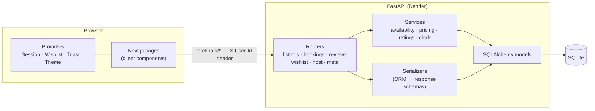

# Airbnb Clone — Full-stack (Next.js + FastAPI + SQLite)

A working copy of Airbnb's **Homes** marketplace. You can browse and search stays, filter them, open a listing, book a date range (with availability checks), see your trips, save favourites, and, as a host, create and manage your own listings. The look and feel follows the current airbnb.com design.

> Built for the Scaler SDE Fullstack assignment. All data and media are mocked (Unsplash photos, seeded users). Payments, messaging and login are simulated, which the brief allows.

| | |
|---|---|
| **Live app** | https://scaler-airbnb-assignment.vercel.app |
| **API (Render)** | https://airbnb-clone-api-ehwa.onrender.com — Swagger docs at [`/docs`](https://airbnb-clone-api-ehwa.onrender.com/docs) |
| **Repository** | https://github.com/Arcanine19-prog/scaler-airbnb-assignment |

> The API runs on Render's free tier and sleeps when idle, so the **first load can take ~30–50 seconds**. After that it's fast.

---

## Feature checklist

| Requirement | Where |
|---|---|
| **Home & search**: grid of cards (photo carousel, title, location, price/night, rating) | `frontend/src/app/page.tsx`, `components/home/ListingCard.tsx` |
| Search bar: location + date range + guests (desktop pill + mobile full-screen sheet) | `components/layout/SearchBar.tsx`, `MobileSearch.tsx` |
| Category row + filters popup (price range with histogram, property type, rooms & beds, amenities) | `components/home/CategoryBar.tsx`, `FiltersModal.tsx` |
| Pagination: infinite scroll plus a "Show more" fallback, paged on the server | `GET /api/listings?page=&page_size=` |
| **Listing detail**: 5-photo grid, photo tour, full-screen viewer, description, amenities, host card, map | `app/rooms/[id]/page.tsx`, `components/listing/*` |
| Availability calendar (booked nights greyed out; a stay can't run across a booking) | `components/common/DateRangeCalendar.tsx` |
| Price breakdown (nightly × nights + cleaning + service fee + taxes) | `backend/app/services/pricing.py` → `GET /listings/{id}/quote` |
| Reviews: overall + 6 category scores, rating distribution, paginated "show all" | `components/listing/Reviews.tsx` |
| **Booking flow**: guest-count and date validation, server-side overlap check, mock "Confirm and pay", confirmation page | `app/book/[id]`, `app/trips/[id]`, `routers/bookings.py` |
| My Trips (upcoming / where you've been / cancelled) + cancel | `app/trips/page.tsx` |
| Bookings are saved and block those dates (calendar + search results) | `services/availability.py` |
| **Host CRUD**: step-by-step "Airbnb your home" form (photos by URL **or upload**), edit, delete | `components/hosting/ListingWizard.tsx`, `app/hosting/*` |
| Host dashboard: stats, reservations by status, listings table with earnings | `app/hosting/page.tsx`, `app/hosting/listings/page.tsx` |
| Airbnb UX: modals, toasts, wishlist hearts, skeleton loaders, sticky booking card | `components/common/*`, `components/providers/*` |
| Guest vs host: simplified login with an account switcher; any user who creates a listing becomes a host | `SessionProvider.tsx`, `deps.py` |
| **Bonus**: interactive map with price pins (Leaflet) | "Show map" on home, map on the detail page, pin picker in the host form |
| **Bonus**: leave a review after a completed stay | Trips → "Leave a review" |
| **Bonus**: Superhost badges + rating aggregation | `services/ratings.py` |
| **Bonus**: image upload | `POST /api/uploads` (stored on the backend's disk) |
| **Bonus**: dark mode | User menu → Dark mode |
| **Bonus**: responsive (mobile / tablet / desktop) | Bottom tab bar, mobile search sheet, sticky reserve bar on phones |
| Placeholders ("Coming soon") | Messages, Help Centre, Experiences/Services tabs, language picker |

## Tech stack

| Layer | Choice |
|---|---|
| Frontend | **Next.js 16** (App Router, TypeScript), Tailwind CSS v4, date-fns, lucide-react icons, Leaflet + react-leaflet (OpenStreetMap/CARTO tiles, no API key) |
| Backend | **Python 3.12, FastAPI**, SQLAlchemy 2.x ORM, Pydantic v2, Uvicorn |
| Database | **SQLite** (custom schema, foreign keys on, CHECK constraints, indexes) |
| Tests | pytest + FastAPI TestClient (11 API tests covering booking rules, search, CRUD, reviews, wishlist) |
| Hosting | Frontend on **Vercel**, backend on **Render** |

## Architecture



**Frontend** (`frontend/src`)

```
app/                    one folder per route (/, /rooms/[id], /book/[id], /trips, /wishlists, /hosting/...)
components/
  layout/               Header (expanding search), SearchBar, MobileSearch, UserMenu, Footer, MobileNav
  home/                 ListingCard, CategoryBar, FiltersModal
  listing/              PhotoGrid, BookingCard, Reviews, Amenities, HostSection
  trips/                ReviewModal, CancelDialog
  hosting/              ListingWizard (create + edit)
  common/               Modal, DateRangeCalendar, GuestPicker, Counter, HeartButton, Maps, Icon, Avatar
  providers/            SessionProvider (mock auth), WishlistProvider, ToastProvider, ThemeProvider
lib/                    api.ts (typed API client), types.ts, search.ts (URL ⇄ search state), format.ts
```

- **Search state lives in the URL** (`/?location=Goa&check_in=…&adults=2&category=beachfront&amenity=10`). Results can be shared, survive a refresh, and back/forward work as on Airbnb.
- **One typed API client** (`lib/api.ts`) wraps `fetch`, adds the mock-auth header, and turns FastAPI errors into readable messages for toasts.
- **Design tokens**: colours are CSS variables (`--ink`, `--muted`, `--line`, `--brand`…) exposed to Tailwind, so dark mode is just a swap of those variables.

**Backend** (`backend/app`)

```
main.py          app factory, CORS, router registration, seeds an empty DB on startup
database.py      engine/session, SQLite foreign-key pragma
models.py        ORM schema (see below)
schemas.py       Pydantic request/response models (the API contract)
deps.py          dependencies: DB session, current user (mock auth via X-User-Id)
serializers.py   ORM → response conversion, shared by every router
routers/         HTTP layer only: validate input, call services, return schemas
services/        business rules: availability.py, pricing.py, ratings.py, clock.py
seed.py          sample-data generator (dates relative to today)
seed_data.py     static sample content (categories, amenities, users, 44 listings)
```

Routers stay thin. Rules such as "can these dates be booked?", "what does this stay cost?" and "is this host a Superhost?" live in `services/`, so the quote endpoint and the booking endpoint share one implementation and can't drift apart.

## Database schema

```mermaid
erDiagram
  USERS ||--o{ LISTINGS : hosts
  USERS ||--o{ BOOKINGS : makes
  USERS ||--o{ REVIEWS : writes
  USERS ||--o{ WISHLIST_ITEMS : saves
  CATEGORIES ||--o{ LISTINGS : groups
  LISTINGS ||--o{ LISTING_PHOTOS : has
  LISTINGS }o--o{ AMENITIES : "listing_amenities"
  LISTINGS ||--o{ BOOKINGS : receives
  LISTINGS ||--o{ REVIEWS : receives
  LISTINGS ||--o{ WISHLIST_ITEMS : "saved in"
  BOOKINGS ||--o| REVIEWS : "reviewed by"

  USERS { int id PK; string name; string email UK; string avatar_url; string location; text bio; bool is_host; datetime created_at }
  CATEGORIES { int id PK; string slug UK; string name; string icon }
  AMENITIES { int id PK; string name UK; string icon; string group }
  LISTINGS { int id PK; int host_id FK; int category_id FK; string title; text description; string property_type; string city; string state; string country; float latitude; float longitude; int price_per_night; int cleaning_fee; int max_guests; int bedrooms; int beds; int bathrooms; datetime created_at; datetime updated_at; datetime deleted_at }
  LISTING_PHOTOS { int id PK; int listing_id FK; string url; int position }
  BOOKINGS { int id PK; int listing_id FK; int guest_id FK; date check_in; date check_out; int guests; string status; int nightly_price; int nights; int cleaning_fee; int service_fee; int taxes; int total_price; datetime created_at }
  REVIEWS { int id PK; int listing_id FK; int author_id FK; int booking_id FK "UNIQUE"; int rating; int cleanliness; int accuracy; int check_in; int communication; int location; int value; text comment; datetime created_at }
  WISHLIST_ITEMS { int id PK; int user_id FK; int listing_id FK; datetime created_at }
```

Design decisions:

- **Guest vs host is a role, not a separate table.** Any user can book, and a user who owns listings is also a host (`is_host` is set when they create their first listing). This matches how Airbnb itself works.
- **Bookings use half-open date ranges `[check_in, check_out)`.** Two bookings overlap exactly when `a.check_in < b.check_out AND a.check_out > b.check_in`. One guest checking out on the day the next guest checks in is allowed. There's a composite index `(listing_id, check_in, check_out)` to support this query.
- **Bookings store a price snapshot** (nightly price, fees, taxes, total). If a host changes the price later, past bookings still show what was actually paid.
- **Cancellations are a status (`confirmed` → `cancelled`), not a delete.** Availability only counts `confirmed` bookings, so cancelling frees the dates and keeps the history.
- **Listings are soft-deleted (`deleted_at`).** Guests' past trips still point at the listing. A listing with upcoming reservations can't be deleted (409).
- **One review per booking** (`reviews.booking_id UNIQUE`), and only after the stay is completed. Each review is tied to a real stay, like Airbnb's verified reviews.
- **Ratings are calculated when read** (SQL `AVG`/`COUNT` grouped per listing or host), not stored on the listing, so they can never drift from the reviews table. Card pages fetch ratings for a whole page in one grouped query (no N+1 queries).
- **Money is stored as whole rupees (integers)**, avoiding floating-point rounding errors.
- **Integrity in the database itself**: `PRAGMA foreign_keys=ON`; CHECK constraints for `check_out > check_in`, positive price and guest count, `rating BETWEEN 1 AND 5`, `status IN (...)`; UNIQUE `(user_id, listing_id)` on wishlist items.

## API overview

Base URL: `/api`. Interactive docs are at **`/docs`** (Swagger) on the backend. Endpoints marked 🔒 need the `X-User-Id` header (simulated login).

| Method | Path | Description |
|---|---|---|
| GET | `/listings` | Search + filters + pagination. Query: `location, check_in, check_out, guests, category, min_price, max_price, property_type[], amenity[], min_bedrooms, min_beds, min_bathrooms, page, page_size`. With dates, listings booked in that window are left out. |
| GET | `/listings/{id}` | Full detail: photos, amenities, host (with Superhost status), rating summary and breakdown |
| GET | `/listings/{id}/unavailable` | Booked `[check_in, check_out)` ranges from today on (for the calendar) |
| GET | `/listings/{id}/quote` | Price breakdown + `available` flag for `check_in, check_out, guests` |
| GET | `/listings/{id}/reviews` | Paginated reviews |
| POST 🔒 | `/listings` | Create a listing (the user becomes a host) |
| PUT 🔒 | `/listings/{id}` | Replace a listing (owner only, 403 otherwise) |
| DELETE 🔒 | `/listings/{id}` | Soft-delete (owner only; 409 if there are upcoming reservations) |
| POST 🔒 | `/bookings` | Book: checks dates, guest limit, not your own listing, no overlap (409) |
| GET 🔒 | `/bookings/me` | My trips, each with `trip_status` (upcoming / current / completed / cancelled) |
| GET 🔒 | `/bookings/{id}` | One booking (visible to its guest and to the listing's host) |
| POST 🔒 | `/bookings/{id}/cancel` | Cancel an upcoming trip (frees the dates) |
| POST 🔒 | `/reviews` | Review a completed stay (once per booking) |
| GET 🔒 | `/wishlist`, `/wishlist/ids` | Saved listings |
| PUT / DELETE 🔒 | `/wishlist/{listing_id}` | Save / remove (idempotent: repeating it is harmless) |
| GET 🔒 | `/host/listings` | My listings, each with upcoming bookings, total bookings and earnings |
| GET 🔒 | `/host/reservations` | All bookings on my listings |
| POST 🔒 | `/uploads` | Upload a listing photo (JPG/PNG/WEBP, ≤ 5MB) → `{url}` |
| GET | `/users`, `/users/me` 🔒, `/categories`, `/amenities`, `/health` | Lookup data |

Errors follow FastAPI's `{"detail": "..."}` format with meaningful status codes: 401 (not logged in), 403 (not your listing), 404, 409 (conflict: dates taken, already reviewed, has reservations), 422 (validation).

## Running locally

Requirements: **Python 3.12+** and **Node 20+**.

```bash
# 1. Backend → http://localhost:8000  (Swagger UI at /docs)
cd backend
python3 -m venv .venv && source .venv/bin/activate
pip install -r requirements-dev.txt
python -m app.seed --reset        # optional: the API also seeds an empty DB on startup
uvicorn app.main:app --reload --port 8000

# 2. Frontend → http://localhost:3000   (in a second terminal)
cd frontend
npm install
cp .env.example .env.local         # NEXT_PUBLIC_API_URL=http://localhost:8000
npm run dev

# Tests
cd backend && pytest
```

**Demo accounts.** Use the user menu (top right) → *Switch account*, or *Profile* on phones:
- **Aarav Gupta** (guest, the default): has upcoming trips, a completed stay waiting for a review, and a cancelled trip.
- **Ananya Sharma** (host, Superhost): 8 listings in Goa with reservations. Use *Switch to hosting* to open the dashboard.
- Five more hosts and seven more guests.

## Deployment

- **Backend → Render** (`render.yaml` Blueprint at the repo root): `rootDir: backend`, build `pip install -r requirements.txt`, start `uvicorn app.main:app --host 0.0.0.0 --port $PORT`, health check `/api/health`. `CORS_ORIGINS` is set to the Vercel URL so only the deployed frontend can call the API from a browser.
- **Frontend → Vercel**: root directory `frontend`, environment variable `NEXT_PUBLIC_API_URL=https://<render-service>.onrender.com`.

## Assumptions & trade-offs

- **Authentication is simplified**, as the brief allows. The frontend sends the selected user's id in an `X-User-Id` header, and the backend resolves it in one dependency (`deps.current_user`). Switching to JWT or session auth would only change that function.
- **Hosting storage**: Render's free tier has no persistent disk, so the SQLite file and uploaded photos reset when the service restarts or redeploys. The API **re-seeds automatically** on an empty database, so the demo is always usable. A paid persistent disk (or Postgres) would make data permanent with no code changes besides `DATABASE_URL`.
- **Cold starts**: free Render services sleep after inactivity, so the first request can take ~30–50s. The UI shows skeleton loaders and a "try again" message meanwhile.
- **Fees**: guest service fee = 14% of the nightly subtotal, taxes = 12% of subtotal + cleaning fee (a flat GST approximation). Both are constants in `services/pricing.py`.
- **Time zone**: all listings are in India, so "today" (for past-date checks and trip status) is evaluated in IST.
- **Max stay** is 90 nights. Check-in can't be in the past. A host can't book their own listing.
- **Concurrency**: the availability check and the insert run under a process-level lock (the API runs as one process on SQLite). With Postgres and several workers this would become a row lock or an exclusion constraint.
- **Guests**: adults + children count towards a listing's limit. Infants and pets don't (Airbnb's rule). Only the total guest count is stored.
- **Branding**: the logo mark is our own drawing and Airbnb Cereal is replaced by Airbnb's own system-font fallback stack. Photos are from Unsplash, avatars from randomuser.me.
- **Placeholders**: messaging, help centre, identity verification, Experiences/Services, language/currency, and real payments (the checkout validates a mock card form in the browser; card data is never sent anywhere).
